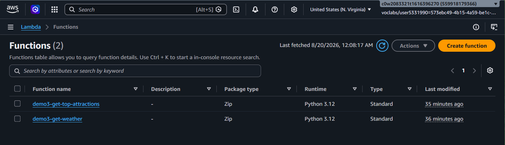
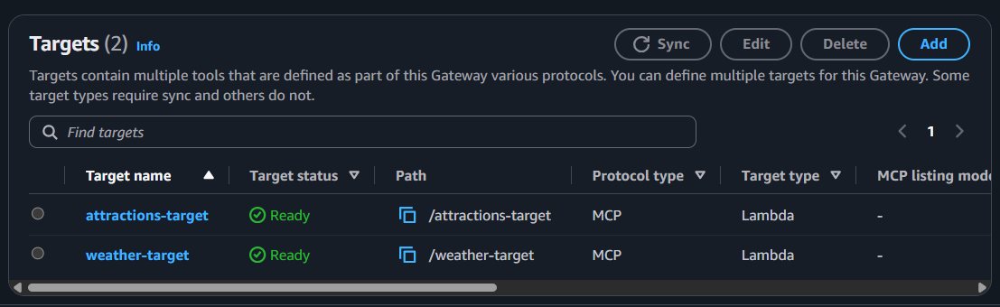
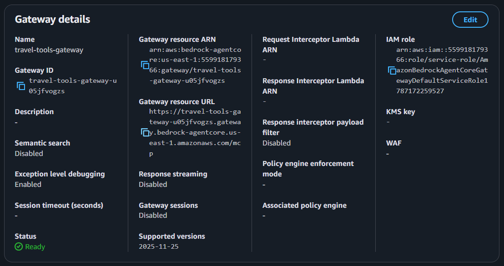
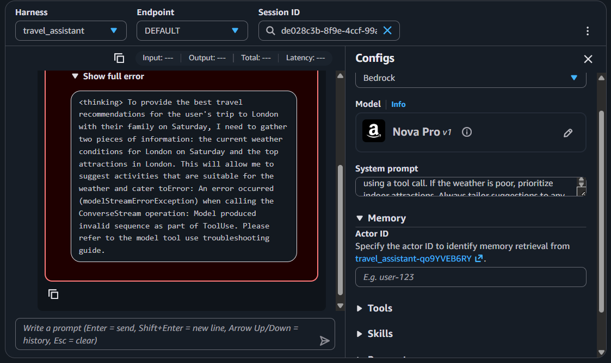
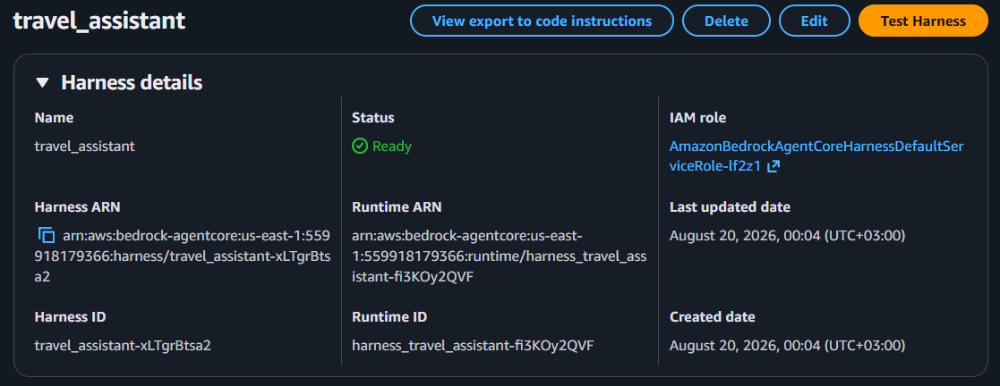
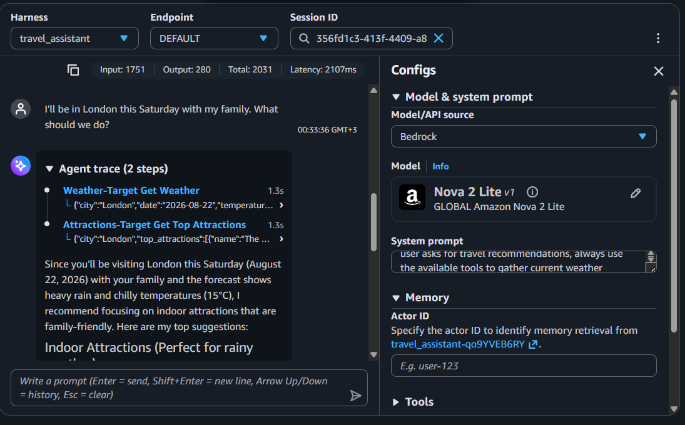

# Autonomous Travel Assistant with AWS Bedrock AgentCore & Lambda

An AI-powered travel planning agent built on **AWS Bedrock AgentCore**. The agent autonomously coordinates multiple AWS Lambda tools to fetch weather forecasts, retrieve city attractions, and make contextual, weather-aware recommendations - all orchestrated through the Model Context Protocol (MCP).

**Portfolio Link:** [AWS Bedrock Assistant](https://freddymorara.tech/work/aws-bedrock-assistant)

---

## Table of Contents

- [Overview](#overview)
- [Architecture](#architecture)
- [Technical Challenges & Pivots](#technical-challenges--pivots)
- [Lambda Implementations](#lambda-implementations)
- [Verification & Output](#verification--output)
- [Project Milestones (Screenshots)](#project-milestones-screenshots)
- [Tech Stack](#tech-stack)

---

## Overview

The original build plan targeted **classic Amazon Bedrock Agents** with Action Groups. Partway through, it became clear that newer AWS accounts default to the **Bedrock AgentCore** ecosystem, where Action Groups have been replaced by **Gateways** and **Harnesses**. This meant re-architecting the solution mid-project rather than following the original blueprint end to end.

The finished agent takes a natural-language prompt (e.g. *"I'll be in London this Saturday with my family. What should we do?"*), calls out to two Lambda-backed tools in parallel (weather + attractions), and reasons over both results to produce a tailored, weather-aware itinerary.

---

## Architecture

```
User Query ──► Bedrock AgentCore Harness ──► MCP Gateway
                                                  │
                     ┌────────────────────────────┴────────────────────────────┐
                     ▼                                                         ▼
        demo3-get-weather (Lambda)                          demo3-get-top-attractions (Lambda)
```

- **Orchestration Layer:** Amazon Bedrock AgentCore Harness
- **Foundational Model:** Amazon Nova 2 Lite
- **Tool Protocol:** Model Context Protocol (MCP) via AgentCore Gateway
- **Compute Layer:** AWS Lambda (Python 3.12)

---

## Technical Challenges & Pivots

### 1. Classic Bedrock Agents → AgentCore Migration

**Problem:** Action Groups from the classic Bedrock Agents workflow are unavailable on newer AWS accounts, which default to AgentCore.

**Solution:** Configured an AgentCore Gateway (`travel-tools-gateway`) with the correct IAM permissions and attached two discrete MCP Lambda targets (`weather-target`, `attractions-target`).


*Both Lambda functions (`demo3-get-weather`, `demo3-get-top-attractions`) deployed on Python 3.12.*

### 2. MCP Inline Schema Mapping

**Problem:** Early gateway creation attempts threw validation errors (`Member must not be null` for `name`, `description`, and `inputSchema`) caused by incorrect wrapper nesting.

**Solution:** Re-engineered the tool definitions as top-level, MCP-compliant JSON arrays instead of nested tool objects:

- **`get_weather`:** requires `city` (string) and `date` (string, `YYYY-MM-DD`)
- **`get_top_attractions`:** requires `city` (string)


*Both MCP Lambda targets attached to the Gateway and showing a `Ready` status.*


*The completed `travel-tools-gateway` - MCP protocol type, resource ARN, and IAM role.*

### 3. Model Tool-Use Sequence Optimization

**Problem:** **Amazon Nova Pro v1** emitted conversational `<thinking>` tokens instead of a strict JSON tool-call sequence, which triggered:

```
modelStreamErrorException: Model produced invalid sequence as part of ToolUse
```


*Nova Pro v1 breaking tool-use parsing with its own `<thinking>` tokens - the `modelStreamErrorException`.*

**Solution:** Switched the inference model to **Amazon Nova 2 Lite**, which adheres strictly to AgentCore's tool-calling sequence and eliminated the parsing errors.

### 4. Lambda Payload Modernization

**Problem:** The legacy Lambda handlers expected classic Bedrock event wrappers (`event['actionGroup']`), which crashed with `KeyError` once the tools were being invoked through AgentCore instead.

**Solution:** Refactored the Python 3.12 handlers to consume AgentCore's flat JSON event structure directly (`event.get('city')`, `event.get('date')`), while keeping the multi-city mock data and dynamic attribute evaluation intact.


*The `travel_assistant` AgentCore Harness, deployed and showing a `Ready` status.*

---

## Lambda Implementations

### `demo3-get-weather`

```python
import json

WEATHER_DB = {
    "london": {
        "2026-08-22": {"temp": "15°C", "condition": "Heavy Rain", "description": "Chilly and wet. Heavy rain expected throughout the day."}
    },
    "paris": {
        "2026-08-22": {"temp": "25°C", "condition": "Sunny", "description": "Clear skies and warm."}
    }
}

def lambda_handler(event, context):
    city = event.get('city', '').lower()
    date = event.get('date', '')
    default_weather = {"temp": "20°C", "condition": "Cloudy", "description": "Overcast but dry."}

    city_data = WEATHER_DB.get(city, {})
    weather = city_data.get(date, default_weather)

    return {
        "city": city.title(),
        "date": date,
        "temperature": weather["temp"],
        "condition": weather["condition"],
        "detailed_forecast": weather["description"]
    }
```

### `demo3-get-top-attractions`

```python
import json

ATTRACTIONS_DB = {
    "london": [
        {"name": "The British Museum", "type": "indoor", "family_friendly": True, "duration": "3-4 hours"},
        {"name": "Tate Modern", "type": "indoor", "family_friendly": True, "duration": "2-3 hours"},
        {"name": "Hyde Park", "type": "outdoor", "family_friendly": True, "duration": "1-2 hours"},
        {"name": "London Eye", "type": "outdoor", "family_friendly": True, "duration": "1 hour"}
    ]
}

def lambda_handler(event, context):
    city = event.get('city', '').lower()
    default_attractions = [{"name": "City Museum", "type": "indoor", "family_friendly": True}]

    return {
        "city": city.title(),
        "top_attractions": ATTRACTIONS_DB.get(city, default_attractions)
    }
```

---

## Verification & Output

**User Prompt:**

> *"I'll be in London this Saturday with my family. What should we do?"*

**Agent Execution:**

1. Calls `get_weather(city="London", date="2026-08-22")` → Heavy Rain, 15°C.
2. Calls `get_top_attractions(city="London")` → 4 attractions (mix of indoor/outdoor).
3. Synthesizes the result: automatically filters out outdoor activities (Hyde Park, London Eye) and recommends **The British Museum** and **Tate Modern**, tailored with wet-weather context.


*Successful end-to-end run on Nova 2 Lite: parallel tool calls, correct filtering, tailored recommendation.*

This confirms the agent isn't just calling tools - it's reasoning over the combined tool outputs to make a context-aware decision.

---

## Tech Stack

- **Cloud Provider:** AWS
- **Agent Orchestration:** Amazon Bedrock AgentCore (Harness + Gateway)
- **Foundation Model:** Amazon Nova 2 Lite
- **Tool Protocol:** Model Context Protocol (MCP)
- **Compute:** AWS Lambda, Python 3.12
- **IAM:** Custom service roles for Gateway and Harness execution

---

## Key Takeaways

- Cloud AI tooling moves fast - a blueprint written for classic Bedrock Agents was already outdated by the time this project started, requiring an on-the-fly migration to AgentCore.
- MCP schema validation is strict about structure (top-level arrays vs. nested wrappers) - error messages like `Member must not be null` are a strong signal to check schema nesting first.
- Not all foundation models handle tool-calling the same way; Nova Pro v1's conversational `<thinking>` tokens broke strict tool-use parsing, while Nova 2 Lite handled it cleanly.
- Legacy backend contracts (`event['actionGroup']`) don't carry over to newer orchestration layers - payload shapes need to be re-verified whenever the orchestration layer changes.

